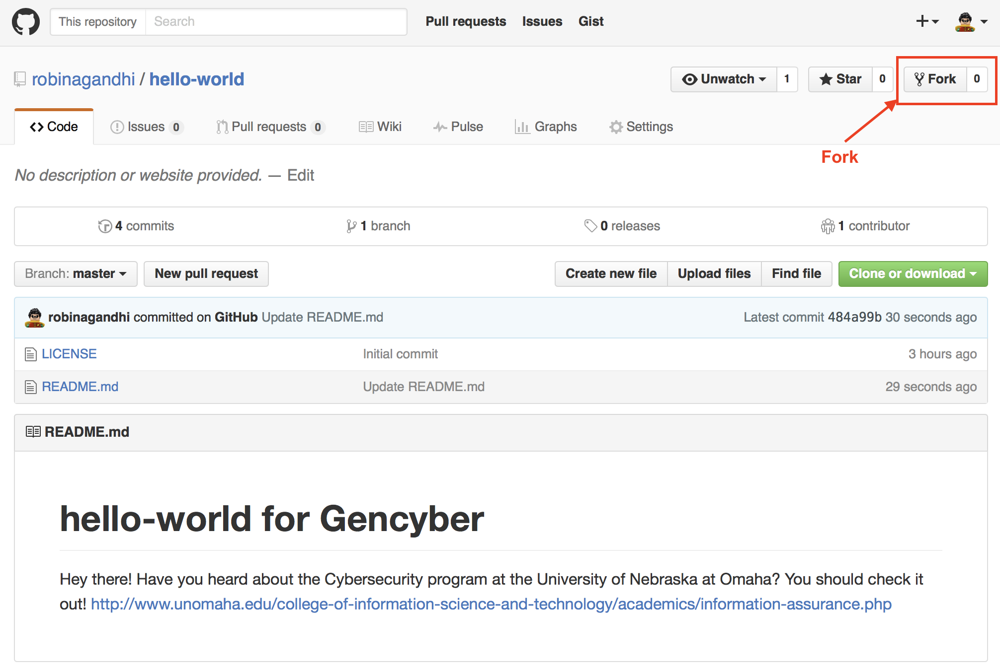
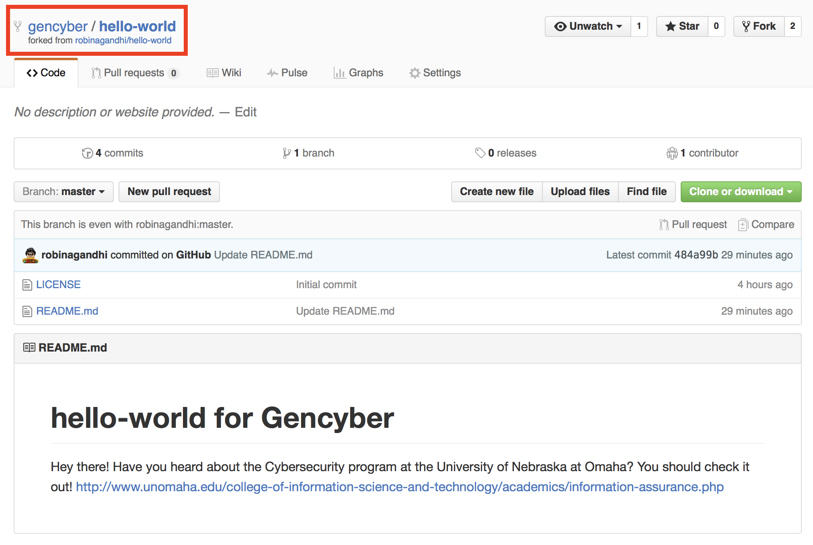
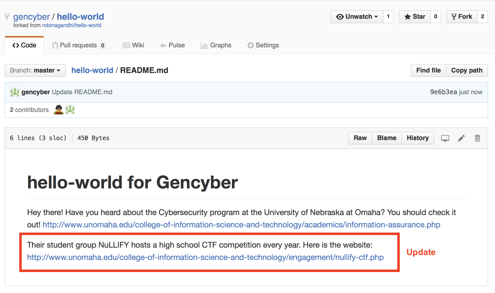
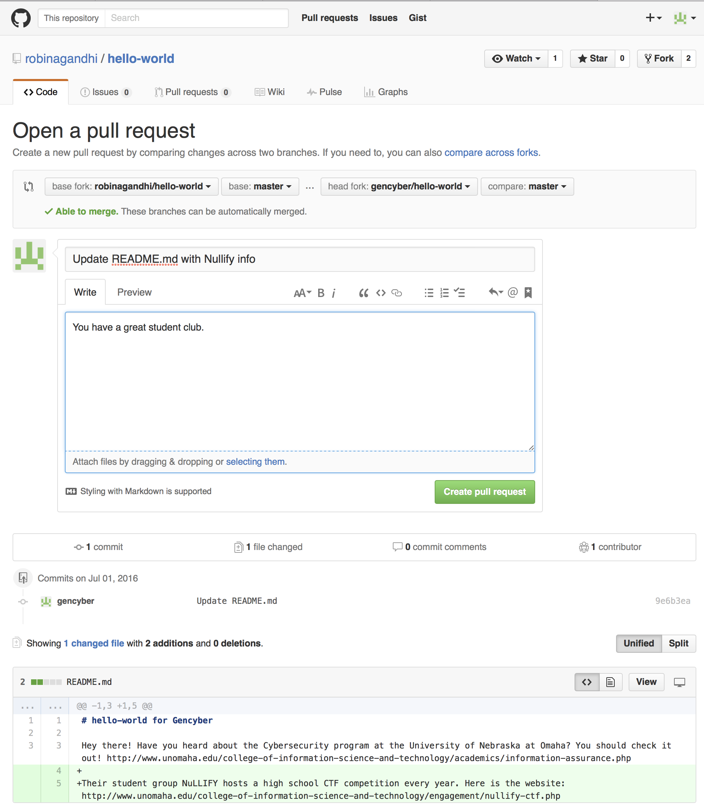
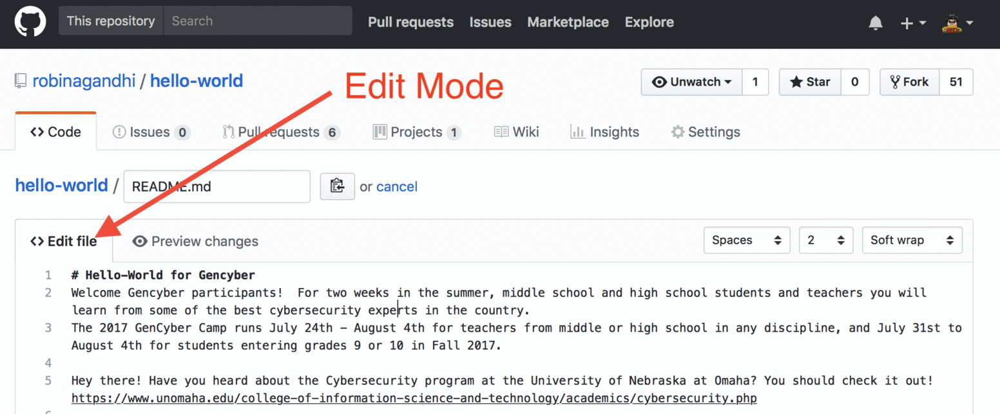

# Github Collaboration

### Cybersecurity First Principles in this lesson

#### Least Privilege
One of the ways to protect information is by limiting what people can see and do with your information and resources. The principle of least privilege says to allow the minimum number of privileges necessary to accomplish the task.
- When collaboratively developing code, each collaborator should only have privileges to play their part.
- For example, a code reviewer should only have the ability to read and comment on code, but not edit it.

### Lesson goals
- Collaborate using Github

### Materials required
- Access to Github.com

### Prerequisite lessons
- [Github Primer](../intro_to_github/README.md)

### Table of Contents
<!-- TOC START min:1 max:3 link:true update:false -->
- [Github Collaboration](#github-collaboration)
    - [Forking a Repository](#forking-a-repository)
    - [Make a Pull Request from a Forked Repository](#make-a-pull-request-from-a-forked-repository)
    - [Authoring Markdown](#markdown)
    - [Fork Our whole camp](#fork-our-whole-camp)
    - [Cyber security First Principles Reflections](#cyber-security-first-principles-reflections)
  - [Additional Resources](#additional-resources)
  - [Acknowledgements](#acknowledgements)
  - [License](#license)

<!-- TOC END -->

Writing code alone is no fun. Collaborative features of Github are integrated in to all aspects of a code repository. For example, Github allows anyone to make a copy of a public repository for their own use. It also allows discussions to support code reviews, bug reports, and code contributions.

You might have heard or seen the phrase "Fork me on Github". Let's start with exploring this feature.

### Forking a Repository
Now we will learn about **forking** a repository. This is as easy as pie. But what is a fork and what do you use it for?

Here is what Github [says](https://help.github.com/articles/fork-a-repo/):
> A fork is a copy of a repository. Forking a repository allows you to freely experiment with changes without affecting the original project.

> Most commonly, forks are used to either propose changes to someone else's project or to use someone else's project as a starting point for your own idea.

> Every public repository can be forked

So head-on over to a hello-world repository developed by one of your peers. You can do this by browsing to the `git URL` of your peer's hello-world repository in your browser.

You should see something like this on your peer's repository:
>

Click the `Fork` button.

After forking, you will have your own copy of your peer's repository to work on. You may `clone` this repository to your local computer, make changes to files and then `push` it back to this forked remote repository. Since you own the forked copy, you do not need permission from the original repository owner.

Forking a repository is a good way to suggest new features to the original repository that you do not own, using a `pull` request. Let's do this in the next step.

[Top](#table-of-contents)

### Make a Pull Request from a Forked Repository
In this step, make changes to the fork of your peers' repository on `Github.com` and create a `pull request`.

Let's assume that a `gencyber` (insert your ID here) user forks `robinagandhi/hello-world` repository (this will be your peer's repository).

The forked repository for the `gencyber` user will look like this:
>

The `gencyber` user now makes changes to the README.md file in this forked repository. She is also the owner of this new `forked` repository.
>

Now to suggest these changes to the `robinagandhi` user; the `gencyber` user needs to create a `pull request`. So the `gencyber` user switches over to the `Pull Request` tab on the forked repository and clicks the **new pull request** button. It will look something like this:
>

Here is an open pull request that compares the master branches across the two repositories.
>

The `robinagandhi` user is now notified of a `pull request` on his hello-world repository. He examines the suggested changes, and in this case, the files can be automatically merged.
>

In cases where files cannot be merged automatically, discussions around the pull request can help to resolve the conflicts manually. In this case that won't be necessary. With a few more simple clicks the changes are `merged`. Your peer will see something like this to confirm the merge:
>

Here is a confirmation message after a successful `merge`:
>

The updated content is now reflected in the peer's repository. It will be something like this:
>

Now return the favor to your peer. Help them `fork` your hello-world repository and make a `pull request` back to you.

A collaborator may on accept your pull request on the first attempt. She may suggest changes. In that case, you may continue to make commits to the branch referenced in your pull request. Github conveniently tracks previous commits, new commits, and discussions along with the pending pull request.

With your peer try going back and forth on your pull request to experience this feature.

And that is one way you can collaborate using `Github`.

[Top](#table-of-contents)

### Markdown
To communicate and write on Github, it is useful to learn `Markdown` and its `Github Flavor Variants`. You may explore this simple format here: https://guides.github.com/features/mastering-markdown/

You can try out the syntax on directly on Github in any file that ends in the extension `.md`. Files with the `.md` extension signify Markdown files. So head on over to your hello-world repository on Github and edit the README.md file. In the edit mode, you can observe the effect of Markdown syntax by clicking on the Preview tab.

In the figure below, When in the preview mode, notice the formatting effect of `#` before text related to a heading.

>

Explore functional uses of Markdown on Github here: https://help.github.com/categories/writing-on-github/

You are now ready to explore the wonderful world of open source on Github. Enjoy and make your own contributions!

[Top](#table-of-contents)

### Fork Our whole camp
We practice what we preach. Our whole camp has been developed on GitHub using markdown, for your viewing pleasure and for you to take home with you. Now that you are a Github/git guru, you may as well fork all of the camp content so that you can extend the content as you wish. But don't forget to tell us about it. We love seeing your work!

Go to the [Github page for the camp modules](https://github.com/MLHale/nebraska-gencyber-modules) and click fork. Boom, just like that you have your very own copy of all the modules. Use with attribution, share widely!

### Cybersecurity First Principles Reflections

On Github, only the `owner` of a remote repository can push commits to it. All other `Github users` have the limited privilege to make a pull request. The repository owner reviews pull requests and initiates a merge action. The owner may reject pull requests if they do not seem appropriate. A `collaborator` can push commits, but cannot delete a repository or add other collaborators. These constraints show the concept of __least privilege__ with GitHub user roles. Users should have no more privilege than what is required for their job.

[Top](#table-of-contents)

## Additional Resources

* Video: [Collaboration Scenarios on Github](https://www.youtube.com/watch?v=jLWZaFzPS6Q)
* Github Guide: [Socialize on Github](https://guides.github.com/activities/socialize/)
* Github Guide: [Documenting your Project on Github](https://guides.github.com/features/wikis/)
* Github Guide: [Creating webpages on Github](https://guides.github.com/features/pages/)

[Top](#table-of-contents)

## Acknowledgements

* A special thanks to Matt Hale, Aaron Vigal and Cade Wollcot for reviews of this module and thoughtful discussions.

[Top](#table-of-contents)

## License
[Nebraska GenCyber](https://github.com/MLHale/nebraska-gencyber)   is licensed under a <a rel="license" href="http://creativecommons.org/licenses/by-nc-sa/4.0/">Creative Commons Attribution-NonCommercial-ShareAlike 4.0 International License</a>.

Overall content: Copyright (C) 2017  [Dr. Matthew L. Hale](http://faculty.ist.unomaha.edu/mhale/), [Dr. Robin Gandhi](http://faculty.ist.unomaha.edu/rgandhi/), and [Doug Rausch](http://www.bellevue.edu/about/leadership/faculty/rausch-douglas).

Lesson content: Copyright (C) [Robin Gandhi](http://faculty.ist.unomaha.edu/rgandhi/) 2017.
 This lesson is licensed by the author under a <a rel="license" href="http://creativecommons.org/licenses/by-nc-sa/4.0/">Creative Commons Attribution-NonCommercial-ShareAlike 4.0 International License</a>.
